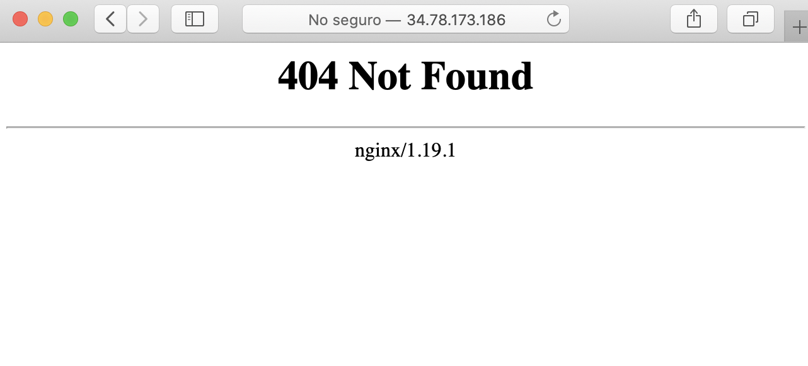
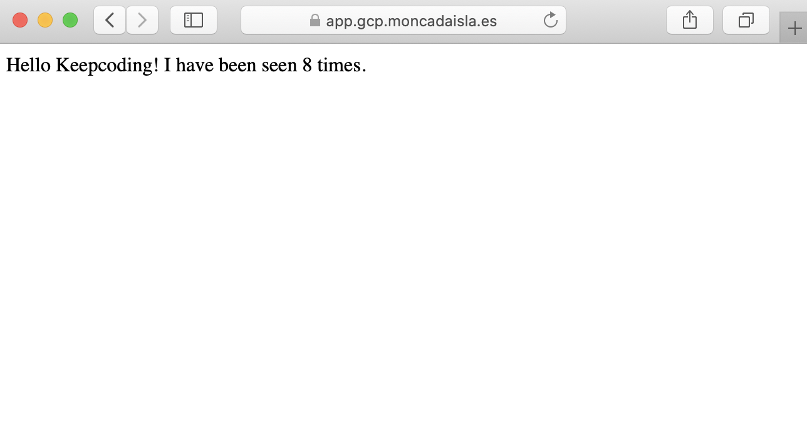
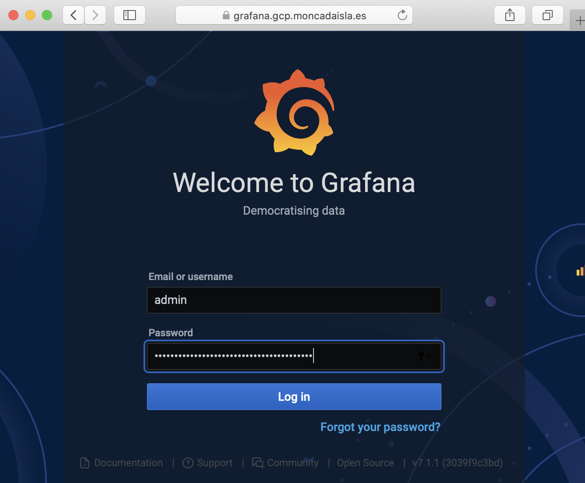
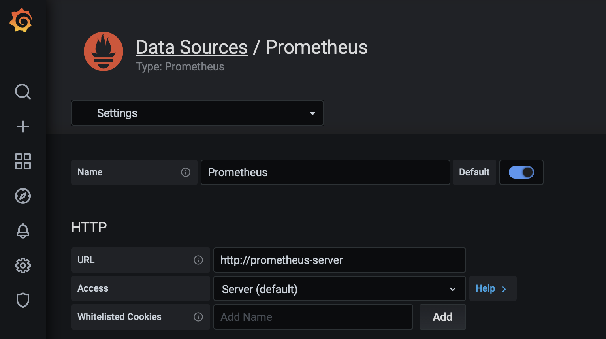
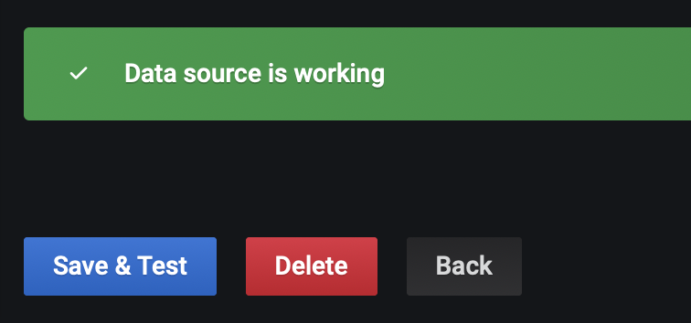
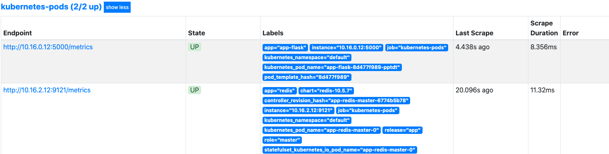
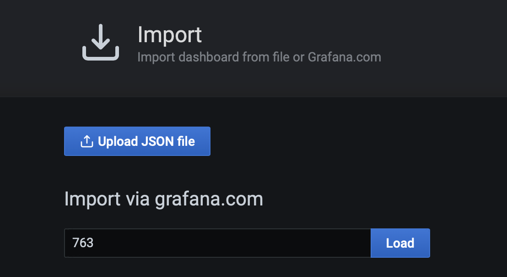
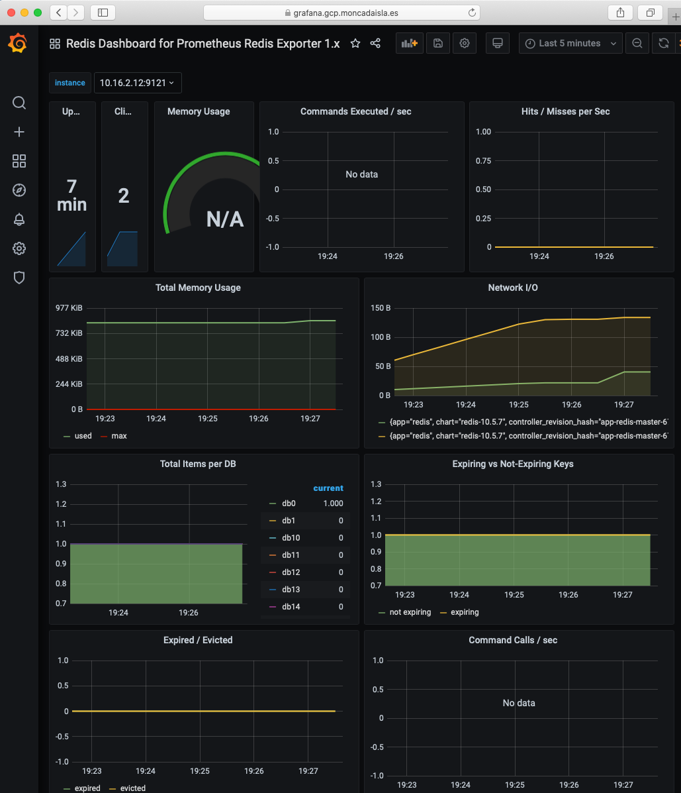
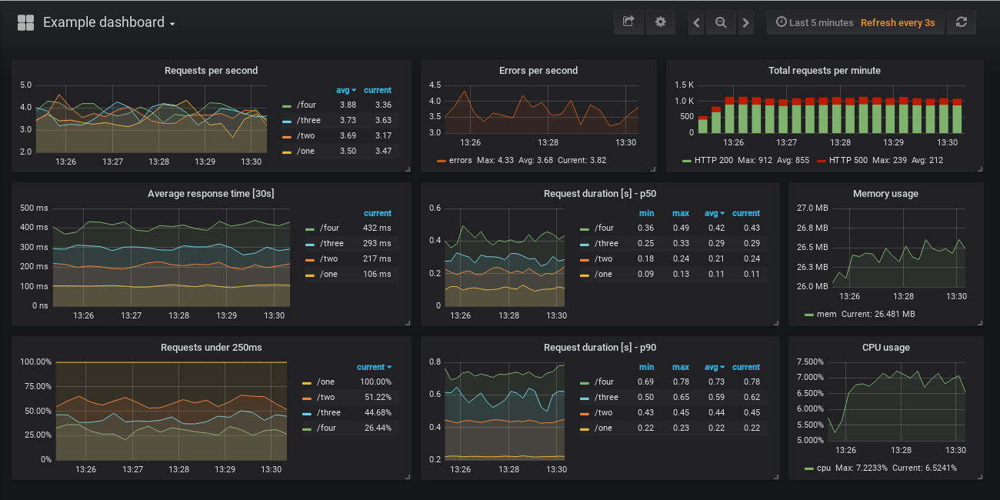
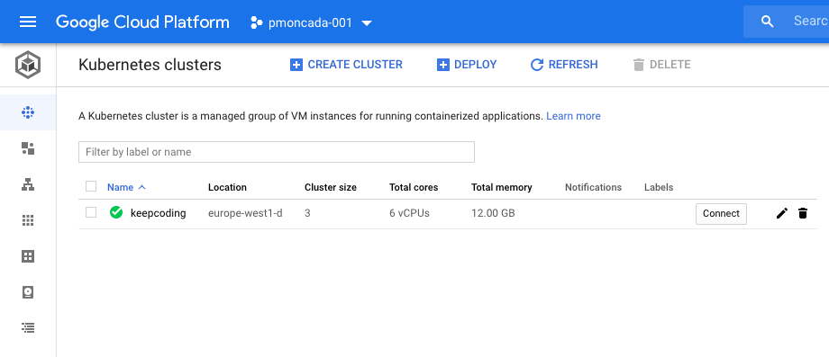

# Práctica final contenedores

En este ejercicio final del curso de contenedores deberemos poner en práctica las lecciones aprendidas sobre Docker, Kubernetes y buenas prácticas DevOps que se han impartido durante el módulo.

En este repositorio encontraremos tanto el enunciado de la práctica como la resolución de cada uno de los apartados.

<!-- TOC -->

- [Práctica final contenedores](#práctica-final-contenedores)
  - [Descripción general](#descripción-general)
  - [Hitos](#hitos)
  - [Solución](#solución)
    - [1. Crear repositorio GIT con la aplicación.](#1-crear-repositorio-git-con-la-aplicación)
    - [2. Crear un fichero README.md](#2-crear-un-fichero-readmemd)
    - [3. Dockerfile](#3-dockerfile)
    - [4. Docker compose](#4-docker-compose)
    - [5. Logs](#5-logs)
    - [6. Configuración](#6-configuración)
    - [7. Generación de manifests de Kubernetes.](#7-generación-de-manifests-de-kubernetes)
      - [7.1 App manifests](#71-app-manifests)
        - [7.1.1 Deployment](#711-deployment)
        - [7.1.2 Configmap](#712-configmap)
        - [7.1.3 Secret](#713-secret)
        - [7.1.4 Service](#714-service)
        - [7.1.5 Ingress](#715-ingress)
      - [7.2 Redis manifests](#72-redis-manifests)
        - [7.2.1 Deployment](#721-deployment)
        - [7.2.2 PersistentVolumeClaim](#722-persistentvolumeclaim)
        - [7.2.3 Service](#723-service)
    - [8. Generación de chart de Helm](#8-generación-de-chart-de-helm)
    - [9. Asegurar que los PODs de la base de datos y la aplicación permanecen lo más juntos posibles al desplegarse en Kubernetes](#9-asegurar-que-los-pods-de-la-base-de-datos-y-la-aplicación-permanecen-lo-más-juntos-posibles-al-desplegarse-en-kubernetes)
    - [10. Asegurar que los PODs de las réplicas de la aplicación permanecen lo más separados posibles.](#10-asegurar-que-los-pods-de-las-réplicas-de-la-aplicación-permanecen-lo-más-separados-posibles)
    - [11. Usar almacenamiento persistente provisionado de forma dinámica para la base de datos.](#11-usar-almacenamiento-persistente-provisionado-de-forma-dinámica-para-la-base-de-datos)
    - [12. Configuración externa mediante secretos y configMaps.](#12-configuración-externa-mediante-secretos-y-configmaps)
    - [13. Instalar Ingress Controller: Nginx](#13-instalar-ingress-controller-nginx)
    - [14. Exponer la aplicación públicamente mediante Ingress.](#14-exponer-la-aplicación-públicamente-mediante-ingress)
    - [15. Exposición de métricas de Prometheus](#15-exposición-de-métricas-de-prometheus)
    - [16. Instalación de Prometheus y grafana, configurando un Dashboard.](#16-instalación-de-prometheus-y-grafana-configurando-un-dashboard)
      - [16.1 Instalación de Prometheus](#161-instalación-de-prometheus)
      - [16.2 Instalación de Grafana](#162-instalación-de-grafana)
      - [16.3 Configuración de datasource en Grafana](#163-configuración-de-datasource-en-grafana)
      - [16.4 Scrape de métricas](#164-scrape-de-métricas)
      - [16.5 Dashboard de redis](#165-dashboard-de-redis)
      - [16.6 Dashboard de nuestra aplicación](#166-dashboard-de-nuestra-aplicación)
    - [17. Instalación de Prometheus mediante un Operador.](#17-instalación-de-prometheus-mediante-un-operador)
    - [18. Instalación de Istio](#18-instalación-de-istio)
    - [19. Configurar un despliegue canary de tipo 80/20 con 2 versiones de aplicación](#19-configurar-un-despliegue-canary-de-tipo-8020-con-2-versiones-de-aplicación)
    - [20. Configurar política de reintentos con Istio](#20-configurar-política-de-reintentos-con-istio)
  - [Apéndices](#apéndices)
    - [A. Creación de cluster de Kubernetes en GKE](#a-creación-de-cluster-de-kubernetes-en-gke)
    - [B. Instalación de Helm](#b-instalación-de-helm)

<!-- /TOC -->

Este repositorio contendrá distintos ficheros y directorios, cada uno hará referencia a una parte de la solución de la aplicación.

- `README.md` contiene el documento principal del enunciado y solución de la práctica.
- `app/` este directorio contiene la aplicación con la solución de la práctica.
- `app/src/` este directorio contiene el código fuente de la aplicación que se usa para la práctica (`flask-counter` en este caso).
- `app/k8s/` este directorio contiene los manifests de Kubernetes.
- `app/charts/` este directorio contiene los charts para desplegar la aplicación con Helm.

## Descripción general

En esta práctica debemos implementar una aplicación consistente en un micro servicio que sea capaz de leer y escribir de una base de datos.

El microservicio y la base de datos son de tu elección.

Puedes basarte en el flask-counter que hemos estudiado durante el curso, desarrollar tu propia aplicación sencilla o basarte en alguna aplicación existente de tu elección (NodeJS, Java, Python, Go, ...).

Puedes usar cualquier lenguaje de programación y cualquier framework.

## Hitos

1. Crear repositorio GIT con la aplicación.
2. Crear un fichero README.md que explique:
   2.1. Descripción de la aplicación.
   2.2. Funcionamiento de la aplicación.
   2.3. Requisitos para hacerla funcionar.
   2.4. Instrucciones para ejecutarla en local
   2.5. Instrucciones para desplegarla en Kubernetes
3. Dockerfile
   3.1. Que compile / dependencias / pruebe la aplicación
   3.2. Que la empaquete con los requisitos mínimos (usar Multistage)
4. Docker compose
   4.1. Que permita ejecutar la aplicación completa en local
5. Logs
   5.1. Formato JSON a ser posible.
   5.2. Asegurarse de que todos los componentes (aplicación y base de datos) mandan sus logs por la salida estándar y salida de error (STDOUT / STDERR).
6. Configurabilidad
   6.1. La aplicación debe de poder ser configurable, por ejemplo, host de la base de datos, puerto, usuario, contraseña, etc. Mediante fichero de configuración y/o variables de entorno.
7. Generación de manifests de Kubernetes en directorio k8s/, mínimo:
   7.1. deployment
   7.2. servicios
   7.3. persistentvolumeclaim (para la BBDD)
   7.4. ingress
   7.5. configmap
   7.6. (secret en la documentación, cómo habría que generarlo)
   7.7. `README.md` describe los recursos creados y documenta todo lo que sea configurable.
8. Generación de chart de Helm en directorio charts/, mínimo:
   8.1. deployment
   8.2. service
   8.3. persistentvolumeclaim (para la BBDD)
   8.4. ingress
   8.5. configmap
   8.6. (secret en la documentación, cómo habría que generarlo)
9. Asegurar que los PODs de la base de datos y la aplicación permanecen lo más juntos posibles al desplegarse en Kubernetes (hacerlo configurable en helm). [OPCIONAL]
10. Asegurar que los PODs de las réplicas de la aplicación permanecen lo más separados posibles (hacerlo configurable en helm). [OPCIONAL]
11. Autoescalar la aplicación cuando pase de un umbral de uso de CPU del 70% (hacerlo configurable en helm), asegurando siempre una alta disponibilidad. [OPCIONAL]
12. Usar almacenamiento persistente provisionado de forma dinámica para la base de datos.
13. Configuración externa mediante secretos y configMaps.
14. Instalar Ingress Controller: [Nginx](https://kubernetes.github.io/ingress-nginx/deploy/) incluyendo los manifiestos y/o instrucciones necesarias en el proyecto (README).
15. Exponer la aplicación públicamente mediante Ingress. Puede usarse servicio de nip.io si no se dispone de DNS.
16. Centralización de Logs [OPCIONAL]
17. Exposición de Métricas [OPCIONAL]
18. Creación de algún dashboard
19. Instala y utiliza algún operador [OPCIONAL]
20. Despliegue de Kubernetes a través de Kops en Google Cloud o AWS [OPCIONAL]

## Solución

### 1. Crear repositorio GIT con la aplicación.

¿Por qué queremos un repositorio GIT para nuestra aplicación? Hemos aprendido y aplicaremos el concepto y metodología de infraestructura como código (Infrastructure as code - IaC por sus siglas en inglés). IaC nos permitirá saber:

- Qué es lo que hay desplegado. Se acabó el tener máquinas virtuales o contenedores sin saber cómo están configurados ni qué cambios se le han ido haciendo.
- Por qué está diseñado de esta manera
- Quién ha hecho los cambios
- Control temporal de los cambios.

Además tanto Docker como Kubernetes encajan muy bien en IaC al proporcionar ficheros declarativos como los `Dockerfile` o los manifests de Kubernetes en formato `yaml`.

Para crear el repositorio GIT lo crearemos en local, es independiente de que además lo tengamos alojado en algún servidor, pero GIT en sí funciona de forma distribuída, y nosotros trabajaremos en nuestro local.

Para crear un repositorio en nuestro ordenador:

```
mkdir practica-final
cd practica-final
git init
```

Será importante ir "grabando" (haciendo `commit`) nuestros cambios a medida que vayamos completando nuestros hitos. Podemos consultar alguna guía para escribir buenos mensajes commits de GIT. [Yo os dejo una](https://blog.kirei.io/buenas-pr%C3%A1cticas-para-los-mensajes-de-commit-en-git-a9fc43a83821?gi=dc0ae48db1f3).

### 2. Crear un fichero README.md

El fichero `README.md` será el punto de entrada de documentación de nuestro repositorio.
Viendo ese fichero deberemos de ser capaces de entender para qué sirve la aplicación, cómo funciona, cómo ha de instalarse y cómo ha de realizarse cualquier operación. También puede incluir indicaciones de cómo desarrollar nuevas funcionalidades de la aplicación o cómo está estructurado el repositorio GIT para que el que llega nuevo pueda ser auto-suficiente y entenderlo, es lo que llamamos procesos de on-boarding.

Imaginaos que nos bajamos una aplicación compleja que venga sin instrucciones, o peor aún, un medicamento que no sepamos ni el nombre ni lo que hace! Para nosotros puede ser muy evidente cómo funciona nuestra aplicación, pero para el resto no lo es, incluso para nuestro "yo del futuro" puede dejar de ser evidente, así que es importante documentar todo lo que podamos.

El `README.md` lo escribiremos en formato Markdown, que es un lenguaje que se caracteriza por ser legible incluso sin formatear y que nos permite darle un formato apropiado a nuestros documentos. Os aconsejo leer sobre Markdown y sentiros familiarizados con él. Si usáis editores como VScode existen extensiones que nos ayudan a escribir Markdown y a previsualizar en tiempo real lo que escribimos.

*aclarar*(((Tenéis un ejemplo de `README.md` de la práctica en TODO.)))

### 3. Dockerfile

El fichero `Dockerfile` nos permitirá construir la imagen Docker con nuestra aplicación para poder ejecutarla en cualquier sitio, incluído Kubernetes.

La solución final del fichero resultante la podemos ver en [`app/src/Dockerfile`](app/src/Dockerfile).

Una primera versión del `Dockerfile` podría ser esta:

```dockerfile
FROM python:3.7-alpine

WORKDIR /app

RUN apk add --no-cache gcc musl-dev linux-headers
COPY requirements.txt requirements.txt
RUN pip install -r requirements.txt

COPY . .

ENV FLASK_APP app.py
ENV FLASK_RUN_HOST 0.0.0.0
ENV REDIS_HOST "redis"
ENV REDIS_PASSWORD ""

EXPOSE 5000

CMD ["flask", "run"]
```

Ese sería un Dockerfile válido para ejecutar nuestra aplicación:

- Primero definimos la imagen en la que nos basamos, `python:3.7-alpine`
- Instalamos dependencias que son necesarias para instalar las dependencias de nuestra aplicación (valga la redundancia): `gcc musl-dev linux-headers`
- Instalamos las dependencias de nuestra aplicación, que al ser una aplicación Python están definidos en `requirements.txt`
- Definimos las variables de entorno que va a usar nuestra aplicación y el puerto que se va a exponer por defecto
- Y definimos el CMD por defecto.

Esta imagen tiene un tamaño de `228MB`:

```
docker build -t app-normal .
docker images |grep  app-normal
app-normal                                                           latest                   9a17a7e1d1fd        6 seconds ago        228MB
```

¿Podemos optimizar más la imagen? Desde luego que sí. Por ejemplo, todas las dependencias que hemos instalado para preparar la aplicación ya no las queremos para nada. Aquí viene al rescate una build con un Dockerfile `multi-stage`, en la que podemos crear bloques reutilizables y copiar lo que nos interese de una build a otra sin tener que arrastrar absolutamente todo.

Podéis revisar cómo funcionan los multi-stage Dockerfiles en la [documentación oficial](https://docs.docker.com/develop/develop-images/multistage-build/) o en la documentación del curso.

```dockerfile
FROM python:3.7-alpine as base

FROM base AS dependencies

WORKDIR /install

RUN apk add --no-cache gcc musl-dev linux-headers
COPY requirements.txt /requirements.txt
RUN pip install --prefix=/install -r /requirements.txt

FROM base

COPY --from=dependencies /install /usr/local

WORKDIR /app
COPY . .

ENV FLASK_APP app.py
ENV FLASK_RUN_HOST 0.0.0.0
ENV REDIS_HOST "redis"
ENV REDIS_PASSWORD ""

EXPOSE 5000

CMD ["flask", "run"]
```

Ahora podemos ver que la imagen es mucho más pequeña, tan solo `78MB`, es un 65% más pequeña (que se dice pronto):

```
docker build -t app-multistage .
docker images |grep  app-multistage
app-multistage                                                               latest                   b5ed0d01569f        About a minute ago   78MB
```

### 4. Docker compose

Para poder ejecutar esta aplicación deberemos primero construir la imagen y después arrancar un contenedor y todas sus dependencias. En este caso esta aplicación depende de un servidor de `redis` para poder funcionar, ya que ahí almacenará la caché del contador, podríamos arrancar la aplicación de la siguiente manera:

```
docker build -t app .
docker network create practice
docker run -d --name redis --network practice redis
docker run -ti --rm -p 5000:5000 --network practice app
```

1. Construirmos el contendor
2. Creamos una `docker network` para que la usen los contedores que queremos que se comuniquen entre sí.
3. Arrancamos un contendor con la imagen de `redis` dentro de la `docker network`.
4. Arrancamos el contenedor de nuestra aplicación con todas las opciones de configuración dentro de la `docker network`.

Esos pasos podríamos resumirlos en un solo fichero `docker-compose.yml`

Lo podemos hacer de la siguiente manera:

```yaml
version: "3.9"
services:
  app:
    build: .
    ports:
      - "5000:5000"
    links:
      - redis
  redis:
    image: redis
```

Una vez tenemos nuestro [`app/src/docker-compose.yml`](app/src/docker-compose.yml) podemos ejecutarlo con: `docker-compose up`

TODO: actualizar esto:
```
docker-compose up
[...]
Attaching to src_redis_1, src_app_1
redis_1  | 1:C 22 Feb 2022 20:59:49.029 # oO0OoO0OoO0Oo Redis is starting oO0OoO0OoO0Oo
redis_1  | 1:C 22 Feb 2022 20:59:49.029 # Redis version=6.2.6, bits=64, commit=00000000, modified=0, pid=1, just started
redis_1  | 1:C 22 Feb 2022 20:59:49.029 # Warning: no config file specified, using the default config. In order to specify a config file use redis-server /path/to/redis.conf
redis_1  | 1:M 22 Feb 2022 20:59:49.030 * monotonic clock: POSIX clock_gettime
redis_1  | 1:M 22 Feb 2022 20:59:49.031 * Running mode=standalone, port=6379.
redis_1  | 1:M 22 Feb 2022 20:59:49.031 # Server initialized
redis_1  | 1:M 22 Feb 2022 20:59:49.032 * Ready to accept connections
app_1    |  * Serving Flask app 'app.py' (lazy loading)
app_1    |  * Environment: production
app_1    |    WARNING: This is a development server. Do not use it in a production deployment.
app_1    |    Use a production WSGI server instead.
app_1    |  * Debug mode: off
```

Y podemos acceder en el navegador a http://localhost:5000.

### 5. Logs

Los logs de una aplicación son extremadamente valiosos para comprobar que funciona correctamente, poder hacer `debugging` e incluso hacer análisis de datos a posteriori.

Distinguiremos 2 tipos de logs:

- Logs informativos
- Logs de errores

En un entorno tradicional los logs de la aplicación normalmente se escriben en un fichero, los informativos en uno y los de errores en otro. En una aplicación que se está ejecutando en un contenedor Docker los logs no deben escribirse a un fichero, debido a la volatilidad de los contenedores, deben escribirse a la salida estándar `stdout` y a la salida de errores `stderr` y será el demonio de Docker el que se encargue de recopilar los logs de cada contenedor que se esté ejecutando en el host.

Para poder escribir los logs en JSON lo más fácil es utilizar una librería de logs, para este caso hemos optado por utilizar [json-logging-python](https://github.com/thangbn/json-logging-python).

Añadimos las dependencias

```python
import logging, sys, json_logging
```

y que no se nos olvide añadir `json_logging` también a `requirements.txt`.

Inicializamos la librería:

```python
json_logging.init_flask(enable_json=True)
json_logging.init_request_instrument(app)

# init the logger as usual
logger = logging.getLogger("logger")
logger.setLevel(logging.DEBUG)
logger.addHandler(logging.StreamHandler(sys.stdout))
```

Ahora ya podemos utilizar las funciones del objeto `logger` que nos permite escribir logs, en este ejemplo hemos utilizado:

- `logger.info()` para mostrar información general por el log. También es el utilizado por la librería para los logs de Flask ya que tiene una integración por defecto.
- `logger.error()` para loguear un error.
- `logger.exception()` para loguear una excepción.

Podemos ver ejemplos de los distintos logs:

Error:

```json
{
  "written_at": "2020-08-01T18:34:07.655Z",
  "written_ts": 1596306847655217000,
  "msg": "Can't connect to redis",
  "type": "log",
  "logger": "logger",
  "thread": "Thread-1",
  "level": "ERROR",
  "module": "app",
  "line_no": 31,
  "correlation_id": "95933df4-d425-11ea-adf8-0242ac110002"
}
```

Excepción:

```json
{
  "written_at": "2020-08-01T18:34:07.655Z",
  "written_ts": 1596306847655657000,
  "msg": "Error -2 connecting to redis:6379. Name does not resolve.",
  "type": "log",
  "logger": "logger",
  "thread": "Thread-1",
  "level": "ERROR",
  "module": "app",
  "line_no": 32,
  "exc_info": "Traceback (most recent call last):\n  File \"/usr/local/lib/python3.7/site-packages/redis/connection.py\", line 559, in connect\n    sock = self._connect()\n  File \"/usr/local/lib/python3.7/site-packages/redis/connection.py\", line 585, in _connect\n    socket.SOCK_STREAM):\n  File \"/usr/local/lib/python3.7/socket.py\", line 752, in getaddrinfo\n    for res in _socket.getaddrinfo(host, port, family, type, proto, flags):\nsocket.gaierror: [Errno -2] Name does not resolve\n\nDuring handling of the above exception, another exception occurred:\n\nTraceback (most recent call last):\n  File \"/app/app.py\", line 28, in get_hit_count\n    return cache.incr('hits')\n  File \"/usr/local/lib/python3.7/site-packages/redis/client.py\", line 1641, in incr\n    return self.incrby(name, amount)\n  File \"/usr/local/lib/python3.7/site-packages/redis/client.py\", line 1650, in incrby\n    return self.execute_command('INCRBY', name, amount)\n  File \"/usr/local/lib/python3.7/site-packages/redis/client.py\", line 898, in execute_command\n    conn = self.connection or pool.get_connection(command_name, **options)\n  File \"/usr/local/lib/python3.7/site-packages/redis/connection.py\", line 1192, in get_connection\n    connection.connect()\n  File \"/usr/local/lib/python3.7/site-packages/redis/connection.py\", line 563, in connect\n    raise ConnectionError(self._error_message(e))\nredis.exceptions.ConnectionError: Error -2 connecting to redis:6379. Name does not resolve.\n",
  "filename": "app.py",
  "correlation_id": "95933df4-d425-11ea-adf8-0242ac110002"
}
```

Y un log de acceso HTTP cuándo se accede a una página de nuestra aplicación, en este caso accediendo a `http://localhost:5000/health/live`:

```json
{
  "written_at": "2020-08-01T18:34:45.676Z",
  "written_ts": 1596306885676369000,
  "type": "request",
  "correlation_id": "ac3cc78c-d425-11ea-adf8-0242ac110002",
  "remote_user": "-",
  "request": "/health/live",
  "referer": "-",
  "x_forwarded_for": "-",
  "protocol": "HTTP/1.1",
  "method": "GET",
  "remote_ip": "172.17.0.1",
  "request_size_b": -1,
  "remote_host": "172.17.0.1",
  "remote_port": 34788,
  "request_received_at": "2020-08-01T18:34:45.676Z",
  "response_time_ms": 0,
  "response_status": 200,
  "response_size_b": 2,
  "response_content_type": "text/html; charset=utf-8",
  "response_sent_at": "2020-08-01T18:34:45.676Z"
}
```

Con la librería `json_logging` de python tenemos un formato predefinido para los logs. Si tuviéramos que elegir un formato podemos basarnos en la propuesta de Google de [LogEntry](https://cloud.google.com/logging/docs/reference/v2/rest/v2/LogEntry) en la que nos dan ya un modelo a seguir.
También podemos modificar el formato de logs de `json_logging` usando un [custom format](https://github.com/thangbn/json-logging-python/blob/master/example/custom_log_format.py).

### 6. Configuración

La aplicación debe de ser configurable, puesto que no siempre va a ejecutarse en el mismo sitio. Entre los distintos valores de configuración podemos destacar el Host de la base de datos, el puerto, contraseña, etc.

Podemos pasarle configuración a nuestra aplicación bien con fichero de configuración o bien con variables de entorno.

En este ejercicio hemos elegido hacerlo por variables de entorno, aunque cualquier solución es perfectamente válida.

Definimos que valores vamos a querer que se puedan configurar vía variable de entorno en el código:

```python
REDIS_HOST = os.environ['REDIS_HOST']
REDIS_PORT = os.environ['REDIS_PORT']
REDIS_PASSWORD = os.environ['REDIS_PASSWORD']
```

y posteriormente usamos dichas variables:

```
cache = redis.Redis(host=REDIS_HOST, port=int(REDIS_PORT), password=REDIS_PASSWORD)
```

No olvidemos definir estas variables de entorno el el Dockerfile, así quien sea que vaya a hacer uso de nuestra imagen Docker puede ver de un vistazo qué varibales de entorno son configurables. En el `Dockerfile` podemos definir:

```
ENV REDIS_HOST "redis"
ENV REDIS_PORT "6379"
ENV REDIS_PASSWORD ""
```

Además le damos un valor por defecto por si no queremos cambiar la configuración que viene dada.

### 7. Generación de manifests de Kubernetes.

Vamos a preparar la aplicación para desplegarla en Kubernetes y para ello crearemos un directorio `app/k8s` que contenga los manifests (ficheros `yaml`) de Kubernetes.

Para este ejemplo vamos a generar:

- `app-deployment` que va a definir la configuración de los PODs de la aplicación.
- `redis-deployment` que va a definir la configuración del POD de redis (la solución no soporta múltiples pods de redis).
- `service` nos permitirá dirigir tráfico a los PODs dentro del clúster
- `persistentvolumeclaim` permitirá solicitar un disco persistente que usaremos para la base de datos (Redis).
- `ingress` para exponer nuestra aplicación fuera del clúster y accesible desde internet.
- `configmap` lo usaremos para guardar la configuración de la aplicación.
- `secret` lo usaremos también para guardar la configuración de la aplicación, pero en este caso solo valores sensibles (por ejemplo, la contraseña de Redis).

Vamos a desplegar nuestra aplicación `app` que para funcionar necesita un `redis`, así que los manifests referentes a la aplicación contendrán el prefijo `app-` y los de redis el prefijo `redis-`.

Nota: `redis` se podría desplegar como un `StatefulSet` en lugar de un `Deployment`. Al no soportar múltiples réplicas de redis (tendríamos que documentarnos para ver cómo hacerlo y tener un redis distribuido multinodo), tanto el `Deployment` como el `StatefulSet` de una réplica nos darán un resultado similar.


#### 7.1 App manifests

Vamos a ir viendo las partes importantes de cada uno de ellos

##### 7.1.1 Deployment

Lo tenemos disponible en [`app/k8s/app-deployment.yaml`](app/k8s/app-deployment.yaml).

Para el valor de `image` deberemos haber subido la imagen anteriormente a algún sitio. Si no tenemos ninguno siempre podemos hacerlo en Dockerhub y tener la imagen pública (cualquiera se la podría bajar). Suponiendo que `MI_USUARIO_DOCKERHUB` es nuestro usuario en Dockerhub:

```
docker build -t app .
docker tag app MI_USUARIO_DOCKERHUB/app:v1.0.0
docker login # Hacemos login en Dockerhub
docker push MI_USUARIO_DOCKERHUB/app:v1.0.0
```

Y ya tendríamos la imagen disponible en `MI_USUARIO_DOCKERHUB/app:v1.0.0`, podríamos poner en el yaml de Kubernetes:

```yaml
spec:
  containers:
    - image: MI_USUARIO_DOCKERHUB/app:v1.0.0
```

Nuestra aplicación está dotada tanto de check de `liveness` como de `readiness`.

El `readinessProbe` indicará a Kubernetes cuándo nuestra aplicación está completamente levantada y lista para recibir tráfico. Muy útil por ejemplo para cuándo escalemos la aplicación con más réplicas o cuándo despleguemos una nueva versión. De este modo Kubernetes únicamente le mandará tráfico a las réplicas que estén ya levantadas y listas.

El `livenessProbe` por otro lado le servirá a Kubernetes para saber que nuestra aplicación está funcionando correctamente. Si el `livenessProbe` devuelve un error o no contesta, entonces Kubernetes se encargará de reiniciar nuestra aplicación automáticamente.

Necesitamos poder pasarle a nuestra aplicación ciertos parámetros que dejamos previamente configurables, en concreto los parámetros de conexión a Redis. Nuestra aplicación acepta los valores por variables de entorno, por lo que usaremos el bloque `env` de un Pod. Definiremos 3 variables de entorno `REDIS_HOST`, `REDIS_PORT` y `REDIS_PASSWORD`. Podemos poner el valor directamente en el deployent de la siguiente manera:

```yaml
env:
  - name: REDIS_HOST
    value: "redis"
```

pero para este ejemplo hemos tomado la decisión de desacoplarlo y leer los valores desde Configmap para el caso de las variables de host y puerto, y desde un secreto para la contraseña.

Para las 2 primeras:

```yaml
- name: REDIS_HOST
  valueFrom:
    configMapKeyRef:
      name: app-config
      key: redis.host
```

y para la variable secreta:

```yaml
- name: REDIS_PASSWORD
   valueFrom:
      secretKeyRef:
         name: redis
         key: password
```

Nos faltaría crear tanto el `Secret` "redis" como el `ConfigMap` "app-config". Eso lo veremos en los siguientes puntos.

Y por último, y recordad que sumamente importante, definir cuántos recursos de computación puede usar nuestra aplicación para que no resulte en una devastación:

```yaml
resources:
  requests:
    memory: 128Mi
    cpu: 100m
  limits:
    memory: 256Mi
    cpu: 200m
```

Definimos los valores mínimos con `resources.requests` y los máximos con `resources.limits`. Si superamos el valor de `resources.limits.memory` Kubernetes reiniciará nuestra aplicación con un evento de `OOMKill` que significa "Out of memory Kill" o "Muerte por falta de memoria", así que es necesario que este valor no sea demasiado bajo si queremos que nuestra aplicación pueda arrancar y funcionar con normalidad.

##### 7.1.2 Configmap

Lo tenemos disponible en [`app/k8s/app-configmap.yaml`](app/k8s/app-configmap.yaml).

El fichero de `ConfigMap` contiene las opciones de configuración de nuestra aplicación:

```yaml
apiVersion: v1
data:
  redis.host: redis
  redis.port: "6379"
kind: ConfigMap
metadata:
  name: app-config
```

**Truco**: Podemos generarlo mediante el cli de `kubectl` de la siguiente forma:

```
kubectl create configmap app-config --from-literal=redis.host=redis --from-literal=redis.port=6379 --dry-run -o yaml > app-configmap.yaml
```

##### 7.1.3 Secret

El fichero de `Secret` no lo vamos a generar, dado que lo subiríamos al repositorio y dejaría de ser secreto.

¿Qué opciones tenemos entonces?

- Generarlo y cifrarlo, entonces ya sí podemos subirlo.
- Dejar instrucciones de cómo se generaría para poder ejecutar la aplicación (Haremos esto).

Generar secreto:

```
kubectl create secret generic redis --from-literal=password=secret
```

mediante ese comando crearemos un secreto que se llamará "redis" con una clave en su interior "password" y un valor "secret". Podemos ver la salida que produce si añadimos las opciones `--dry-run -o yaml`.

```yaml
apiVersion: v1
data:
  password: c2VjcmV0
kind: Secret
metadata:
  name: redis
```

##### 7.1.4 Service

Lo tenemos disponible en [`app/k8s/app-svc.yaml`](app/k8s/app-svc.yaml).

El service recordemos que actuará a modo de balanceador interno (también externo si fuera de `spec.type: LoadBalancer`). Nosotros usaremos `Ingress` para exponer nuestra aplicación de forma pública, así que nos limitaremos a que sea un un servicio de tipo `ClusterIP` (el por defecto).

```yaml
apiVersion: v1
kind: Service
metadata:
  labels:
    run: flask
  name: flask
spec:
  ports:
    - port: 5000
      protocol: TCP
      targetPort: 5000
  selector:
    run: flask
  type: ClusterIP
```

Es importante que `spec.selector` coincida con los labels del deployment definidos en `spec.template.metadata.labels`. En este caso ambos son `run: flask`.

Mediante el `selector` el service sabrá a qué PODs tiene que mandar el tráfico. Podemos darnos cuenta que un POD no tiene por qué tener un único servicio, podría recibir tráfico de múltiples servicios a la vez, los casos de uso son variados.

##### 7.1.5 Ingress

Lo tenemos disponible en [`app/k8s/app-ingress.yaml`](app/k8s/app-ingress.yaml). Necesita que el ingress controller esté instalado (explicado posteriormente).

Mediante el objeto de tipo `Ingress` expondremos la aplicación a internet. Veamos algunos detalles relevantes, aunque el ejemplo es lo más simple posible:

Vemos en `metadata.annotations` que tiene definido `kubernetes.io/ingress.class: nginx`. Esto hará que este `Ingress` solo funcione con un `IngressController` de tipo `nginx` que deberá de estar desplegado. Si no esecificamos este annotation entonces usará el `IngressController` que haya por defecto en el clúster.

El la sección `spec.rules` especificaremos las reglas que querremos que manden tráfico a nuestra aplicación.

En este caso únicamente será necesario acceder al host `flask-app.keepcoding.local` para poder acceder a nuestra aplicación.

Quedaría tal que:

```yaml
apiVersion: networking.k8s.io/v1
kind: Ingress
metadata:
  name: flask
  annotations:
    kubernetes.io/ingress.class: nginx
spec:
  rules:
  - host: flask-app.keepcoding.local
    http:
      paths:
      - pathType: Prefix
        path: "/"
        backend:
          service:
            name: flask
            port:
              number: 5000
```

El tráfico será entregado al servicio llamado `flask` en el puerto `5000` que ya hemos definido previamente.

#### 7.2 Redis manifests

Vamos a ir viendo las partes importantes de cada uno de ellos.

##### 7.2.1 Deployment

Lo tenemos disponible en [`app/k8s/redis-deployment.yaml`](app/k8s/redis-deployment.yaml).

Vamos a ver las partes más relevantes, dado que el resto son similares a las de nuestra aplicación.

En primer lugar, queremos que nuestro servidor de redis tenga autenticación (contraseña), por lo que deberemos configurarlo como tal. Podremos modificar el argumento de arranque:

```yaml
args: ["--requirepass", "$(REDIS_PASS)"]
```

Tenemos más información acerca de cómo configurar autenticación en redis en la [documentación oficial](https://redis.io/commands/auth).

La contraseña de redis de la misma manera la proporcionaremos como secreto, y dado que tienen que coincidir no vamos a mantener y gestionar 2 secretos a la vez, podemos hacer uso del mismo secreto que ya teníamos en la aplicación (secreto `redis`):

```yaml
env:
- name: REDIS_PASS
   valueFrom:
      secretKeyRef:
         name: redis
         key: password
```

Y por último, queremos que nuestra aplicación tenga persistencia, esto es, que si se reinicia los datos sigan permanenciendo ahí. Por defecto `redis` almacena los datos en el directorio `/data`, así que tendremos que montar un volumen en dicho directorio:

```yaml
volumeMounts:
- name: data
   mountPath: /data
```

El volumen que montaremos lo definiremos desde un `persistentVolumeClaim` que nos permitirá asignar un `persitentVolume` que esté disponible en el cluster o bien que se cree dinámicamente mediante los storage provisioner dentro de nuestro proveedor cloud.

```yaml
volumes:
- name: data
   persistentVolumeClaim:
   claimName: redis-pv-claim
```

##### 7.2.2 PersistentVolumeClaim

Lo denemos disponible en [`app/k8s/redis-pvc.yaml`](app/k8s/redis-pvc.yaml).

Mediante el `pvc` solicitaremos al cluster que haya un volumen persistente disponible de las características deseadas. En nuestro caso solicitaremos un volumen de `20GB`.

```yaml
apiVersion: v1
kind: PersistentVolumeClaim
metadata:
  name: redis-pv-claim
  labels:
    app: redis
spec:
  accessModes:
    - ReadWriteOnce
  resources:
    requests:
      storage: 20Gi
```

Si nuestro proveedor cloud dónde tenemos desplegado el cluster de Kubernetes no soporta creación dinámica de volúmenes, tendremos que crearlo previamente a mano y referenciarlo en el `pvc`.

Todas las opciones de configuración están disponibles en la [documentación oficial de Kubernetes](https://kubernetes.io/docs/concepts/storage/persistent-volumes/).

##### 7.2.3 Service

Lo tenemos disponible en [`app/k8s/redis-svc.yaml`](app/k8s/redis-svc.yaml).

Para que otras aplicaciones (en nuestro caso `app`) puedan conectarse a Redis deberemos crear el servicio:

```yaml
apiVersion: v1
kind: Service
metadata:
  labels:
    run: redis
  name: redis
spec:
  ports:
    - port: 6379
      protocol: TCP
      targetPort: 6379
  selector:
    run: redis
  type: ClusterIP
```

El servicio al llamarse `redis` nos permitirá conectarnos a él directamente mediante ese nombre.

### 8. Generación de chart de Helm

Helm es nuestro gestor de paquetes en Kubernetes. No es una herramienta oficial pero está ampliamente extendida dentro de la comunidad.

Con Helm podemos instalar aplicaciones con un solo comando o distribuirlas con un único fichero comprimido.

Además nos permitirá reutilizar aplicaciones ya existentes para componer otras aplicaciones.

En nuestro caso crearemos un `chart` para nuestra aplicación `app`. Deberemos crear todos los templates de forma similar a como hemos hecho previamente con los manifests, pero únicamente nos centraremos en crear aquellos que sean de nuestra aplicación a pesar de que depende de `redis`. Para desplegar un `redis` junto con nuestra aplicación usaremos un chart ya existente de redis (`bitnami/redis`) y lo instalaremos como dependencia.

Otra opción más sencilla para `redis` sería incluirlo también como parte de nuestro chart, pero para mostrar cómo funcionan las dependencias usaremos el chart existente.

Un chart de Helm tiene la siguiente estructura (Helm v3):

- Un directorio con el nombre del chart (`app`).
- Un fichero `Chart.yaml` que define los metadatos de nuestro chart y dependencias.
- Un directorio `templates` que contiene los templates de nuestra aplicación.
- Un fichero `values.yaml` que contiene las variables o configuración de nuestra aplicación.

Para comprobar que el chart está correctamente escrito podemos renderizarlo en local con el comando:

```
cd charts/app
helm dependency update # Para descargar las dependencias requeridas
helm template app .
```

Nos daremos cuenta en primer lugar de que la configuración se ha simplificado gracias a que usamos una dependencia de un chart ya existente (`redis`). Gracias a esto nuestro template solamente tendrá los ficheros `deployment.yaml`, `ingress.yaml`, `svc.yaml`, `hpa.yaml` y un fichero con funciones de ayuda llamado `_helpers.tpl`.

Para poder integrar nuestra aplicación con el chart existente de `redis`, hemos tenido que documentarnos y verificar los nombres del servicio y secret generados.

Echemos un ojo al fichero de descripción del chart `Chart.yaml`:

```yaml
apiVersion: v1
name: app
description: Aplicación práctica Keepcoding DevOps Bootcamp V
type: application
version: 1.0.0
appVersion: "1.0.0"

dependencies:
- name: redis
  version: 16.4.0
  repository: https://charts.bitnami.com/bitnami
  condition: redis.enabled
```

aquí definiremos que nuestro Chart depende de otro ya existente y está en un repositorio público de charts. Este es el formato de Chart de Helmv3, podemos consultar todas las opciones disponible en la [documentación oficial de Helm](https://helm.sh/docs/topics/charts/#the-chartyaml-file).

Todas las opciones de configuración de nuestra aplicación las tenemos disponibles en el fichero `values.yaml`:

```yaml
replicas: 1
image:
  name: eedugon/flask-counter
  tag: "1.0"
resources:
  requests:
    memory: 128Mi
    cpu: 100m
  limits:
    memory: 256Mi
    cpu: 200m

# Configuracion autoescalado
autoscaling:
  enabled: false
  minReplicas: 1
  maxReplicas: 10
  targetCPUUtilizationPercentage: 80

# Configuración ingress
ingress:
  enabled: true
  annotations:
    kubernetes.io/ingress.class: nginx
  hosts:
    - host: flask-helm.keepcoding.local
      paths:
      - "/"

redis:
  cluster:
    enabled: false
  metrics:
    enabled: true
```

Si queremos modificar cualquier opción del chart de Redis, podemos añadir cualquier valor que sobreescriba los [valores por defecto de su Chart](https://artifacthub.io/packages/helm/bitnami/redis) bajo la key `redis` del `values.yaml`.

Os habréis podido fijar que ya no tenemos que generar el secreto, esto es porque el chart de redis se encarga de generarlo automáticamente con un valor aleatorio (se puede establecer el valor deseado mediante una propiedad si queremos). Nosotros desde nuestra aplicación directamente hacemos referencia al secreto creado por el chart de redis:

```yaml
env:
- name: REDIS_PASSWORD
  valueFrom:
      secretKeyRef:
         name: {{ .Release.Name }}-redis
         key: redis-password
```

Para instalar el chart del helm podremos customizar los values proporcionando nuestro propio fichero de `values` en el que únicamente tendremos que modificar aquellos valores que deseemos que sean distintos.

**my-custom-values.yaml**:

```yaml
ingress:
  enabled: true
  hosts:
    - host: my-custom-domain.com
      paths:
        - "/"

autoscaling:
  enabled: true
  minReplicas: 1
  maxReplicas: 10
  targetCPUUtilizationPercentage: 20
```

Y a la hora de instalar la release podremos usar el parámetro `-f my-custom-values.yaml` que sobreescribirá los valores. También podemos usar `--set` para cambiar valores directamente desde la línea de comandos. Toda la información sobre como [instalar una release en la documentación de Helm](https://helm.sh/docs/helm/helm_install/).

**Nota**: Se ha añadido un fichero `.gitignore` para que el directorio `charts` dentro de nuestro chart, que es el que contiene la descarga de las dependencias, no se añada al repositorio Git.

### 9. Asegurar que los PODs de la base de datos y la aplicación permanecen lo más juntos posibles al desplegarse en Kubernetes

Para reducir la latencia entre la aplicación y la base de datos los contenedores de ambos deberían de ejecutarse dentro del mismo nodo de Kubernetes.

Será el scheduler de Kuberneres quien decidirá en qué nodo debe de ir cada POD a la hora de ejecutarse. Normalmente intentará distribuir la carga de forma uniforme sin saber si hay algunos PODs que deben de ir junto a otros. Nosotros podemos indicarle al scheduler de Kubernetes nuestra preferencia mediante [pod affinity](https://kubernetes.io/docs/concepts/scheduling-eviction/assign-pod-node/#inter-pod-affinity-and-anti-affinity).

Es una propiedad dentro de la `spec` de un POD de nuestra aplicación, veamos un ejemplo:

```yaml
spec:
  affinity:
    podAffinity:
      preferredDuringSchedulingIgnoredDuringExecution:
        - weight: 100
      podAffinityTerm:
        labelSelector:
          matchExpressions:
            - key: app
          operator: In
          values:
            - redis
        topologyKey: "kubernetes.io/hostname"
```

Dentro de `spec.affinity.podAffinity` configuraremos una regla de tipo `preferredDuringSchedulingIgnoredDuringExecution`, que quiere decir que intentará que se cumpla si es posible cuándo vaya a ejecutar el POD y no hará nada si ya está en ejecución. Intentará que se cumpla frente a otros PODs que encajen con esa expresión de labels, en este caso `app=redis`, es decir, nuestra aplicación intentará reaccionar frente a los pods de la base de datos, que es lo que queremos. Y por último, la clave de topología que hará que se sea la misma será la de `kubernetes.io/hostname`, es decir, hará que esté en el mismo nodo.

Podemos ver la configuración de `spec.affinity.podAffinity` en el deployment de nuestra aplicación.

Al hacer esto en nuestro chart de Helm hemos tenido que investigar los labels creados por el chart de redis, quedando así la sección afinity:

```yaml
        podAffinity:
          preferredDuringSchedulingIgnoredDuringExecution:
          - weight: 100
            podAffinityTerm:
              labelSelector:
                matchLabels:
                  app.kubernetes.io/component: master
                  app.kubernetes.io/instance: {{ .Release.Name }}
                  app.kubernetes.io/name: redis
              topologyKey: "kubernetes.io/hostname"
```

### 10. Asegurar que los PODs de las réplicas de la aplicación permanecen lo más separados posibles

El scheduler de Kubernetes intentará que los PODs de nuestra aplicación hagan que la carga del cluster quede balanceada, pero esto no quiere decir que los separará lo máximo posible, podría poner las 3 réplicas de nuestra aplicación en el mismo nodo y si el nodo tiene un fallo o se tiene que actualizar tendríamos caída de servicio.

Para maximizar la alta disponibilidad (HA) podemos usar reglas de [pod anti-affinity](https://kubernetes.io/docs/concepts/scheduling-eviction/assign-pod-node/#inter-pod-affinity-and-anti-affinity) que harán que los PODs "intenten" repelerse unos a otros para estar en nodos distintos.

De forma similar al pod-affinity visto en el apartado anterior:

```yaml
spec:
  affinity:
    podAntiAffinity:
      preferredDuringSchedulingIgnoredDuringExecution:
        - weight: 100
      podAffinityTerm:
        labelSelector:
          matchExpressions:
            - key: run
          operator: In
          values:
            - flask
        topologyKey: "kubernetes.io/hostname"
```

Para integrar esto en nuestro chart de helm:

```yaml
        podAntiAffinity:
            preferredDuringSchedulingIgnoredDuringExecution:
            - weight: 100
              podAffinityTerm:
                labelSelector:
                    matchExpressions:
                    - key: app
                      operator: In
                      values:
                      - {{ template "app.name" . }}-flask
                topologyKey: "kubernetes.io/hostname"
```

### 11. Usar almacenamiento persistente provisionado de forma dinámica para la base de datos.

Lo hemos visto en el punto 7 cuándo hemos generado los manifests de Kubernetes para `redis`.

Recordemos los puntos importantes para hacer que esto sea posible:

- Crear un `persistentVolumeClaim`, que tenemos disponible en [`app/k8s/redis-pvc.yaml`](app/k8s/redis-pvc.yaml)
- Referenciar dicho `persistentVolumeClaim` desde el `deployment` de `redis` en [`app/k8s/redis-deployment.yaml`](app/k8s/redis-deployment.yaml)

  ```yaml
      volumeMounts:
      - name: data
          mountPath: /data
    volumes:
      - name: data
          persistentVolumeClaim:
          claimName: redis-pv-claim
  ```

El chart de helm de redis automáticamente ha creado PVCs para los pods de redis. Si hemos optado por la opción de incluir redis directamente como un `Deployment` o `StatefulSet` en nuestro chart deberíamos incluir el PVC.

### 12. Configuración externa mediante secretos y configMaps

Este punto también lo hemos hecho previamente al crear los ficheros de `ConfigMap` y `Secret`. Existen varias formas de poder leer el contenido de esos ficheros desde la aplicación, bien desde variables de entorno o bien como un fichero que se monta en el contenedor. Nosotros hemos elegido hacerlo por variables de entorno.

- El fichero de `ConfigMap` está disponible en [`app/k8s/app-configmap.yaml`](app/k8s/app-configmap.yaml)
- Hemos referenciado las vafriables del `Configmap` mediante variables de entorno:

  ```yaml
  env:
  - name: REDIS_HOST
  valueFrom:
     configMapKeyRef:
        name: app-config
        key: redis.host
  - name: REDIS_PORT
  valueFrom:
     configMapKeyRef:
        name: app-config
        key: redis.port
  ```

- El `Secret` lo hemos dejado indicado para crear a gusto de quien realice la instalación, pues debe de ser secreto:

  ```
  kubectl create secret generic redis --from-literal=password=secret
  ```

- Hemos referenciado la contraseña en el `Secret` mediante variable de entorno:

  ```yaml
  - name: REDIS_PASSWORD
    valueFrom:
      secretKeyRef:
        name: redis
        key: password
  ```

### 13. Instalar Ingress Controller: Nginx

Para poder instalar un Ingress Controller necesitamos un cluster de Kubernetes funcionando, para ello podéis referiros al apéndice [A. Creación de cluster de Kubernetes en GKE](#a-creación-de-cluster-de-kubernetes-en-gke) y tener instalado Helm 3.

Creamos el namespace dónde lo vamos a instalar:

```
kubectl create namespace nginx-ingress
```

Y ahora ya podemos instalar nuestra release de helm desde el repositorio oficial:

```
helm repo add ingress-nginx https://kubernetes.github.io/ingress-nginx
helm install --namespace nginx-ingress nginx-ingress ingress-nginx/ingress-nginx
```

```
NAME: nginx-ingress
LAST DEPLOYED: Tue Feb 22 22:15:36 2022
NAMESPACE: nginx-ingress
STATUS: deployed
REVISION: 1
TEST SUITE: None
NOTES:
The ingress-nginx controller has been installed.
It may take a few minutes for the LoadBalancer IP to be available.
...
...
```

Podemos comprobar que los componentes están arrancados:

```
kubectl -n nginx-ingress get pods
NAME                                                      READY   STATUS    RESTARTS   AGE
nginx-ingress-ingress-nginx-controller-7567748d47-92z4l   1/1     Running   0          86s
```

Y podemos ver el servicio de tipo `LoadBalancer` y la IP pública que se ha creado:

```
kubectl -n nginx-ingress get services
NAME                                               TYPE           CLUSTER-IP      EXTERNAL-IP     PORT(S)                      AGE
nginx-ingress-ingress-nginx-controller             LoadBalancer   10.19.249.106   34.78.173.186   80:30074/TCP,443:32407/TCP   116s
nginx-ingress-ingress-nginx-controller-admission   ClusterIP      10.19.245.109   <none>          443/TCP                      116s
```

En este caso la IP pública de acceso al cluster sería `34.78.173.186`.

Si accedemos a http://34.78.173.186 deberíamos ver algo similar a:



### 14. Exponer la aplicación públicamente mediante Ingress.

Ahora que ya tenemos instalado el Ingress Controller y tenemos nuestra aplicación preparada con objeto de tipo `Ingress` vamos a desplegarla en el cluster.

Podemos revisar el punto [7.1.4 Ingress](#714-ingress) para más información sobre el objeto `Ingress` que hemos creado ya previamente.

```
helm install app charts/app
```

Podemos ver que los pods están funcionando:

```
kubectl get pods
NAME                        READY   STATUS    RESTARTS   AGE
app-flask-fd67f9d75-n7hk9   1/1     Running   0          74s
app-redis-master-0          1/1     Running   0          74s
```

Y podemos comprobar que el `Ingress` se ha creado:

```
kubectl get ingress
NAME   HOSTS                    ADDRESS         PORTS     AGE
app    flask-app.keepcoding.local   35.185.236.124   80, 443   76s
```

Si queremos personalizar el nombre del hostname podemos hacerlo proporcionando un fichero de `values.yaml` personalizado a la hora de instalar nuestra release.

Es importante que el nombre DNS esté apuntando a la dirección IP que aparece para que funcione.

Para ello puedes modificar el servidor DNS (si es una zona DNS de un proyecto de GCP por ejemplo) o también podréis añadir una entrada en vuestro fichero `/etc/hosts` del tipo:

```
35.185.236.124 flask-app.keepcoding.local
```

pero sólo para hacer pruebas!

Ahora ya podemos acceder desde la consola o el navegador y ver que está funcionando nuestra aplicación correctamente:

```
curl -vk http://flask-app.keepcoding.local
*   Trying 35.185.236.124:80...
* Connected to flask-app.keepcoding.local (35.185.236.124) port 80 (#0)
> GET / HTTP/1.1
> Host: flask-app.keepcoding.local
> User-Agent: curl/7.79.1
> Accept: */*
>
* Mark bundle as not supporting multiuse
< HTTP/1.1 200 OK
< Date: Tue, 22 Feb 2022 21:24:10 GMT
< Content-Type: text/html; charset=utf-8
< Content-Length: 45
< Connection: keep-alive
<
Hello Keepcoding! I have been seen 38 times.
```



### 15. Exposición de métricas de Prometheus

Para las métricas vamos a:

- Instrumentar la aplicación que hemos construído
- Instalar un exporter para redis que exponga las métricas en formato Prometheus.

Para instrumentar nuestra aplicación vamos a aprovechar que hacemos uso del framework Flask y usar [prometheus-flask-exporter](https://pypi.org/project/prometheus-flask-exporter/), que nos dará métricas básicas de nuestra aplicación.

Añadimos `prometheus_flask_exporter` al `requirements.txt` de Python y después añadiremos a `app.py` lo siguiente:

```python
from prometheus_flask_exporter import PrometheusMetrics

app = Flask(__name__)
metrics = PrometheusMetrics(app)

# static information as metric
metrics.info('app_info', 'Application info', version='1.0.3')
```

Además añadiremos `@metrics.do_not_track()` como anotación a las rutas de los Healthchecks para que no nos ensucien las estadísticas.

Podemos acceder a http://localhost:5000/metrics y ver métricas que se han añadido automáticamente:

```
# HELP flask_http_request_duration_seconds Flask HTTP request duration in seconds
# TYPE flask_http_request_duration_seconds histogram
flask_http_request_duration_seconds_bucket{le="0.005",method="GET",path="/",status="200"} 3.0
flask_http_request_duration_seconds_bucket{le="0.01",method="GET",path="/",status="200"} 4.0
flask_http_request_duration_seconds_bucket{le="0.025",method="GET",path="/",status="200"} 4.0
flask_http_request_duration_seconds_bucket{le="0.05",method="GET",path="/",status="200"} 4.0
flask_http_request_duration_seconds_bucket{le="0.075",method="GET",path="/",status="200"} 4.0
flask_http_request_duration_seconds_bucket{le="0.1",method="GET",path="/",status="200"} 4.0
flask_http_request_duration_seconds_bucket{le="0.25",method="GET",path="/",status="200"} 4.0
flask_http_request_duration_seconds_bucket{le="0.5",method="GET",path="/",status="200"} 4.0
```

Para añadir un exporter de métricas al servidor de redis, podemos simplemente activar la opción de `redis.metrics.enabled` del chart.

En nuestro [`app/charts/app/values.yaml`](app/charts/app/values.yaml).

```yaml
redis:
  cluster:
    enabled: false
  metrics:
    enabled: true
```

### 16. Instalación de Prometheus y grafana, configurando un Dashboard.

#### 16.1 Instalación de Prometheus

Vamos a instalar Prometheus con `Helm 3`:

```
helm repo add prometheus-community https://prometheus-community.github.io/helm-charts
helm install prometheus prometheus-community/prometheus
```

#### 16.2 Instalación de Grafana

Ahora vamos a instalar Grafana y lo dejamos configurado ya con un Ingress:

```
helm repo add grafana https://grafana.github.io/helm-charts

helm install grafana grafana/grafana \
   --set ingress.enabled=true \
   --set ingress.hosts={grafana.keepcoding.local} \
   --set ingress.annotations={kubernetes.io/ingress.class:nginx}
```

Podemos obtener la contraseña por defecto ejecutando:

```
kubectl get secret --namespace default grafana -o jsonpath="{.data.admin-password}" | base64 --decode ; echo
```

Podemos acceder a la página de login: https://grafana.gcp.moncadaisla.es/



Nota: Si no tenéis Ingress controller o no lo queréis tener expuesto a internet, siempre podéis hacer un port-forward y redirigir el puerto a vuestro local:

```
kubectl port-forward svc/grafana 3000:80
```

y acceder a http://localhost:3000

#### 16.3 Configuración de datasource en Grafana

En grafana tendremos que añadir el datasource de Prometheus:

https://grafana.gcp.moncadaisla.es/datasources

Añadiremos un datasource de tipo Prometheus y dirección `http://prometheus-server`



Al hacer click sobre "Save & Test" deberá decirnos que funciona correctamente:



#### 16.4 Scrape de métricas

Vamos ahora a pintar un dashboard de nuestra aplicación, para ello primero deberemos de decirle a Prometheus que debe recoger las métricas de nuestra `app`, podemos añadir las siguientes anotaciones:

```yaml
annotations:
  prometheus.io/path: /metrics
  prometheus.io/port: "5000"
  prometheus.io/scrape: "true"
```

Podemos comprobar que Prometheus está recogiendo las métricas de la aplicación accediendo a la interfaz de Prometheus:

```
kubectl port-forward svc/prometheus-server 9090:80
```

Si miramos en http://localhost:9090/targets podremos ver:



lo que quiere decir que está recogiendo correctamente las métricas tanto de `app` como de `redis`.

#### 16.5 Dashboard de redis

Podemos acceder a https://grafana.gcp.moncadaisla.es/dashboard/import y cargar un dashboard ya hecho por la comunidad, por ejemplo https://grafana.com/grafana/dashboards/763



Nos pintará un dashboard por defecto similar al siguiente:



#### 16.6 Dashboard de nuestra aplicación

Podemos hacernos nuestro propio dashboard o basarnos en [alguno de ejemplo como este de rucys86](https://github.com/rycus86/prometheus_flask_exporter/blob/master/examples/sample-signals/grafana/dashboards/example.json).

Podemos cargar directamente el JSON del dashboard en Grafana:



### 17. Instalación de Prometheus mediante un Operador.

Podemos instalar Prometheus mediante un operador. Hacerlo de esta forma nos facilitará tener más de un servidor de Prometheus y que podamos operarlos todos de forma fácil y escalable.

Con [helm](https://github.com/helm/charts/tree/master/stable/prometheus-operator) la tarea es bastante sencilla:

```
helm install stable/prometheus-operator
```

Una vez instalado el operador podemos instalar un servidor de Prometheus mediante el objeto de tipo `Prometheus` que nos proporciona gracias a los [CRDs](https://kubernetes.io/docs/concepts/extend-kubernetes/api-extension/custom-resources/) de Kubernetes.

## Apéndices

### A. Creación de cluster de Kubernetes en GKE

Podemos crear un cluster de 3 nodos básico mediante:

```
gcloud beta container --project "pmoncada-001" clusters create "keepcoding" \
   --zone "europe-west1-d" --cluster-version "1.15.12-gke.2" \
   --machine-type "e2-medium" --image-type "COS" --disk-type "pd-standard" --disk-size "100" \
   --num-nodes "3"
```

Podremos ver que se ha creado correctamente desde la consola de GCP.



Y nos podremos conectar posteriormente:

```
gcloud container clusters get-credentials keepcoding --zone europe-west1-d --project pmoncada-001
```

y comprobar que funciona:

```
kubectl get nodes
NAME                                        STATUS   ROLES    AGE   VERSION
gke-keepcoding-default-pool-8f0306f2-02q4   Ready    <none>   62s   v1.15.12-gke.2
gke-keepcoding-default-pool-8f0306f2-676b   Ready    <none>   62s   v1.15.12-gke.2
gke-keepcoding-default-pool-8f0306f2-xbxp   Ready    <none>   62s   v1.15.12-gke.2
```

**Nota**: Ajustar el nombre del proyecto al que corresponda vuestro, en mi caso es "pmoncada-001".

### B. Instalación de Helm

Para la instalación de Helm deberéis descargar el binario de `Helm 3`.
Podéis hacerlo viendo la documentación de https://helm.sh/docs/intro/install/.
